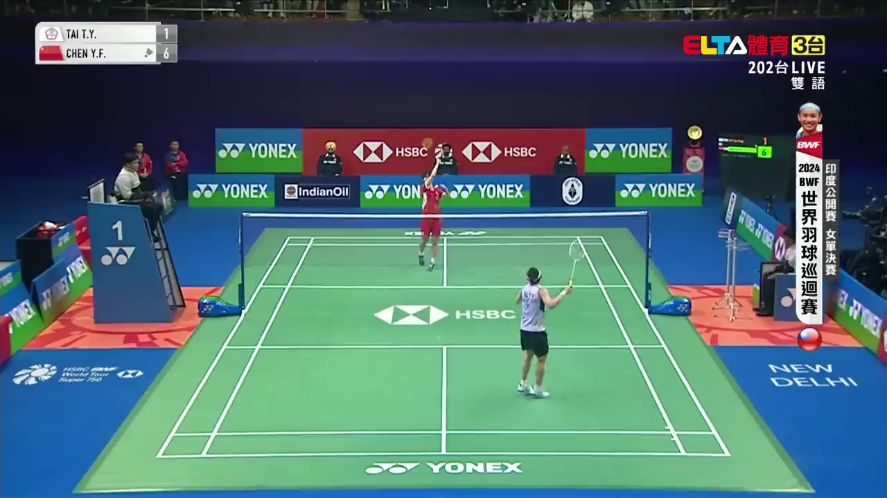
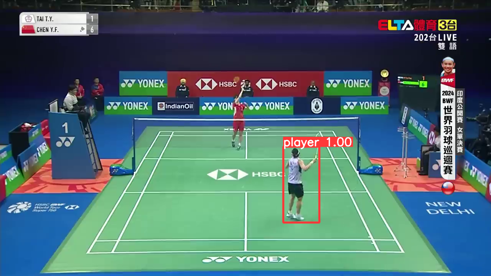

# YOLO 羽毛球選手偵測專案

基於 YOLOv9 的羽毛球選手偵測系統，能夠準確識別羽毛球比賽中的選手位置。

## 📋 專案概述

使用 YOLOv9-c 模型訓練了一個專門用於偵測羽毛球選手的物件偵測系統。透過在羽毛球比賽影像上的訓練，模型能夠高精度地識別場上的選手。

## 🎯 功能特色

- **高精度偵測**：在驗證集上達到 98.5% mAP@0.5
- **即時處理**：支援圖片和影片的即時偵測
- **專業訓練**：基於羽毛球比賽場景的專門數據集
- **易於使用**：提供完整的訓練和推理腳本

## 📊 模型效能

| 指標 | 數值 |
|------|------|
| Precision | 94.7% |
| Recall | 97.1% |
| mAP@0.5 | 98.5% |
| mAP@0.5:0.95 | 81.2% |

## 📁 檔案結構

```
yolo/
├── yolo_test.ipynb          # 完整的訓練和測試 Colab 筆記本
├── train.png                # 原始羽毛球場影像範例
├── test.png                 # 偵測結果展示影像
└── README.md                # 專案說明文件
```

**注意**：由於資料集檔案過大，未包含在此儲存庫中。請參考下方說明準備自己的資料集。

## 🚀 快速開始

### 環境需求

- Python 3.8+
- PyTorch 1.7+
- CUDA 支援的 GPU（建議）
- Google Colab（推薦）

### 使用 Google Colab 執行（推薦）

1. 上傳 `yolo_test.ipynb` 到 Google Colab
2. 確保已啟用 GPU 加速（執行階段 → 變更執行階段類型 → GPU）
3. 準備你的羽毛球資料集並上傳到 Google Drive
4. 依序執行所有程式碼區塊

**資料集需求**：
- 羽毛球比賽影像（PNG/JPG 格式）
- 對應的 YOLO 格式標註檔案（TXT 格式）
- 資料集配置檔案（datasets.yaml）

### 本地端安裝

```bash
# 克隆 YOLOv9 儲存庫
git clone https://github.com/caijiayou/yolov9_v1.git
cd yolov9_v1

# 安裝相依套件
pip install -r requirements.txt

# 下載預訓練權重
wget https://github.com/WongKinYiu/yolov9/releases/download/v0.1/yolov9-c.pt
```

**注意**：本地端執行需要自行準備羽毛球資料集。建議使用 Google Colab 以獲得完整的使用體驗。

## 📚 使用方法

### 1. 準備數據集

**重要提醒**：由於資料集檔案過大，未包含在此儲存庫中。你需要準備自己的羽毛球資料集。

確保你的數據集符合 YOLO 格式：
```
datasets/
├── images/
│   ├── train/          # 訓練影像檔案
│   ├── val/            # 驗證影像檔案
│   └── test/           # 測試影像檔案
├── labels/
│   ├── train/          # 訓練標註檔案 (.txt)
│   ├── val/            # 驗證標註檔案 (.txt)
│   └── test/           # 測試標註檔案 (.txt)
└── datasets.yaml       # 資料集配置檔案
```

**資料集格式說明**：
- 影像檔案：支援 JPG、PNG 格式
- 標註檔案：YOLO 格式的 TXT 檔案，每行格式為 `class_id x_center y_center width height`
- 配置檔案：YAML 格式，定義類別數量和路徑

**取得資料集的建議方式**：
1. 使用公開的羽毛球資料集
2. 自行收集羽毛球比賽影像並標註
3. 使用標註工具如 LabelImg 或 Roboflow 進行標註

### 2. 訓練模型

```bash
python train_dual.py \
--batch 4 --epochs 20 --img 640 --device 0 \
--data datasets.yaml \
--weights yolov9-c.pt \
--cfg models/detect/yolov9-c.yaml
```

**注意**：確保 `datasets.yaml` 中的路徑指向你的資料集位置。

### 3. 進行偵測

```bash
python detect_dual.py \
--weights runs/train/exp/weights/best.pt \
--conf 0.75 \
--source path/to/your/image.jpg \
--device 0
```

## 📸 結果展示

### 偵測前


### 偵測後


模型成功偵測到羽毛球場上的選手，並以紅色邊界框標示，信心分數達到 1.00。

## 🔧 訓練參數

本專案使用的主要訓練參數：

- **批次大小 (Batch Size)**: 4
- **訓練世代 (Epochs)**: 20
- **影像尺寸 (Image Size)**: 640x640
- **信心閾值 (Confidence Threshold)**: 0.75
- **學習率 (Learning Rate)**: 0.01
- **優化器 (Optimizer)**: SGD

## 📈 訓練過程

訓練過程包含以下階段：
1. **資料準備**：載入羽毛球選手數據集
2. **模型初始化**：使用 YOLOv9-c 預訓練權重
3. **訓練執行**：20 個世代的訓練過程
4. **模型驗證**：在驗證集上評估效能
5. **結果輸出**：生成最佳模型權重
